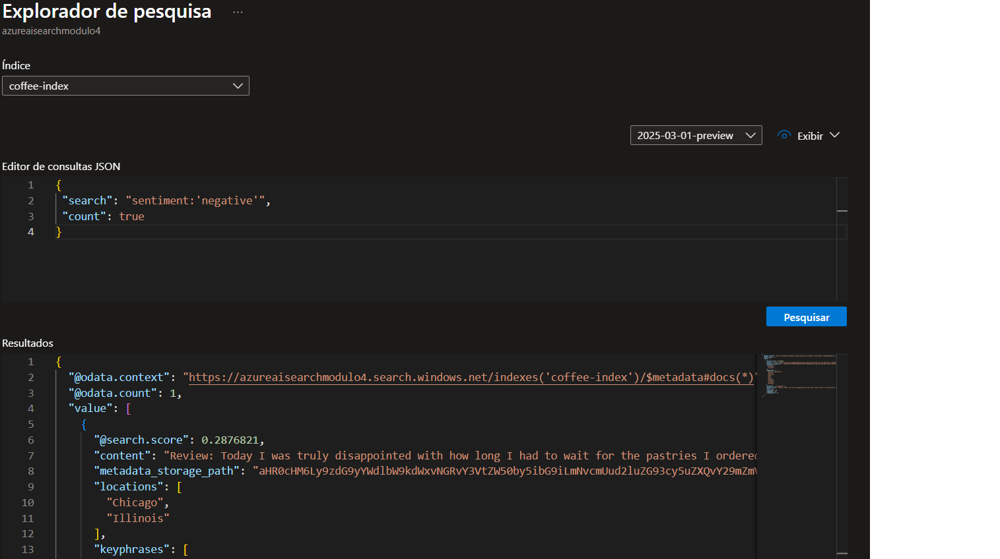

# Detalhamento das Etapas do Laboratório de Azure AI Search

Este laboratório geralmente guia o usuário através das seguintes etapas para construir uma solução básica de pesquisa inteligente de documentos usando o Azure AI Search:

## 1. Configuração do Ambiente Azure

* **Criação de um Grupo de Recursos:** O primeiro passo é criar um grupo de recursos no Azure para conter todos os serviços relacionados a este laboratório. Isso ajuda na organização e no gerenciamento dos recursos.
* **Implantação do Serviço Azure AI Search:** Em seguida, é necessário provisionar uma instância do serviço Azure AI Search dentro do grupo de recursos criado. Isso envolve especificar um nome para o serviço, a localização e o tipo de preço.
* **Obtenção das Chaves e Endpoint:** Após a implantação, o laboratório geralmente instrui a obter as chaves de administrador e a URL do endpoint do serviço Azure AI Search. Essas credenciais são essenciais para interagir programaticamente com o serviço.

## 2. Preparação dos Dados

* **Upload de Documentos de Amostra:** O laboratório geralmente fornece um conjunto de arquivos de documentos de amostra (em formatos como PDF, TXT, DOCX, etc.) que serão usados para a indexação e pesquisa. Esta etapa envolve o upload desses documentos para um local acessível pelo Azure AI Search, como o Azure Blob Storage.
* **Criação de um Contêiner de Blob Storage (se necessário):** Caso os documentos ainda não estejam em um local acessível, pode ser necessário criar uma conta de armazenamento Azure e um contêiner de blob dentro dela para armazenar os documentos.

## 3. Criação do Índice de Pesquisa

* **Definição do Schema do Índice:** Esta é uma etapa crucial onde se define a estrutura do índice de pesquisa. Isso envolve especificar os campos que serão pesquisáveis, filtráveis, ordenáveis e recuperáveis. Para cada campo, define-se seu nome, tipo de dados e os atributos de pesquisa relevantes.
* **Criação do Índice no Azure AI Search:** Com o schema definido, o índice é criado no serviço Azure AI Search. Este índice é onde os dados dos documentos serão armazenados de forma otimizada para pesquisa.

## 4. Ingestão de Dados (Indexação)

* **Criação de um Conector de Fonte de Dados (Datasource):** Para conectar o Azure AI Search aos documentos armazenados (por exemplo, no Blob Storage), um conector de fonte de dados é configurado. Isso especifica a localização dos dados e as credenciais de acesso, se necessário.
* **Criação de um Indexador:** Um indexador é um serviço que automatiza o processo de leitura dos dados da fonte de dados, aplicando qualquer processamento necessário (como extração de texto) e, em seguida, populando o índice de pesquisa com esses dados. O laboratório geralmente guia na configuração e execução de um indexador.

## 5. Exploração e Consulta do Índice de Pesquisa

* **Utilização do Explorador de Pesquisa (Search Explorer):** O portal do Azure fornece uma ferramenta chamada "Search Explorer" que permite executar consultas de pesquisa diretamente no índice criado. O laboratório geralmente demonstra como usar essa ferramenta para realizar pesquisas simples e avançadas, aplicar filtros, ordenar resultados e explorar a estrutura do índice.
* **Construção de Consultas de Pesquisa (Opcional):** Em alguns casos, o laboratório pode introduzir a construção de consultas de pesquisa programaticamente usando a API REST do Azure AI Search ou um SDK (como o SDK do Python ou .NET). Isso pode envolver a compreensão da sintaxe de consulta e como especificar parâmetros como termos de pesquisa, filtros, ordenação e paginação.

## 6. Enriquecimento com Inteligência Artificial (Opcional, mas provável)

* **Criação de um Conjunto de Habilidades (Skillset):** Uma das características poderosas do Azure AI Search é a capacidade de integrar serviços de IA para enriquecer os dados durante a indexação. Um "skillset" é uma coleção de habilidades de IA (como análise de sentimento, extração de frases-chave, reconhecimento de entidades nomeadas, tradução, OCR para imagens em PDFs, etc.) que podem ser aplicadas aos documentos.
* **Configuração de Habilidades:** O laboratório pode guiar na seleção e configuração de habilidades específicas para extrair informações relevantes dos documentos e adicioná-las ao índice de pesquisa.
* **Associação do Skillset ao Indexador:** O skillset é então associado ao indexador, para que as habilidades sejam aplicadas aos documentos à medida que são processados e indexados.

## 7. Análise e Insights

* **Exploração dos Dados Indexados e Enriquecidos:** Após a indexação com enriquecimento de IA (se aplicável), o laboratório pode pedir para explorar os dados no índice para observar os resultados das habilidades aplicadas (por exemplo, as frases-chave extraídas, o sentimento detectado, etc.).
* **Discussão sobre os Insights Obtidos:** A etapa final geralmente envolve uma discussão sobre os insights que podem ser obtidos ao aplicar técnicas de IA aos dados e como isso melhora a capacidade de pesquisa e descoberta de informações.

## Estrutura de Pastas de Imagens

* **A seguinte estrutura de pastas foi utilizada para organizar as imagens geradas durante o desafio:

index/
├── index-review.png
original/
├── original-review.png

## Exemplos de Imagens

### Documentos Originais

Exemplo de uma representação visual de documentos originais:

* 

### Resultados da Indexação e Análise

Abaixo, exemplo de visualização gerada durante o processo de indexação e análise:

| Análise de Sentimento                              |
| :------------------------------------------------- | 
| 

## Contato
Se tiver dúvidas ou sugestões, entre em contato:
- GitHub: [JulianoTurra](https://github.com/JulianoTurra)